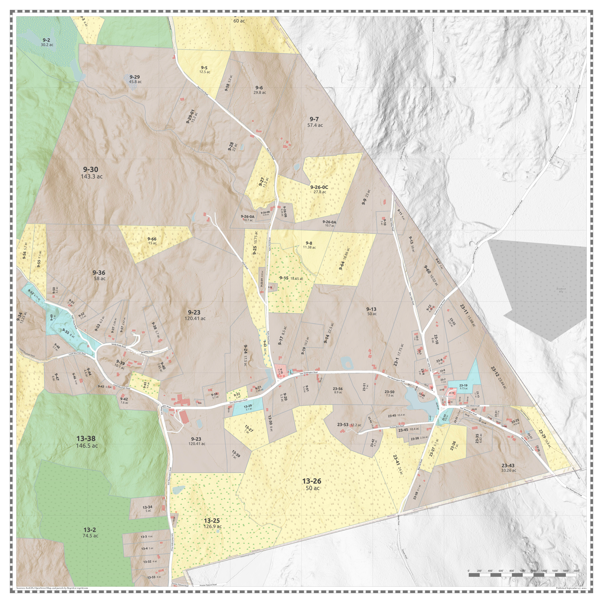

# Washington NH Parcel Map

We combine map sources from [ArcGIS](https://arcgis.com) and [OpenStreetMap](https://openstreetmap.org) with lotlines originally acquired from [Regrid](https://regrid.com), together with data extracts from the Washington assessors's database to produce a complete map of all the parcels in town, plus 5 detail insert maps.

Map are available at Town Hall, or you can order your own copies!

- [Washington NH Parcel Map](#washington-nh-parcel-map)
  - [Washington (4' x 3')](#washington-4-x-3)
  - [Town Center (3' x 2')](#town-center-3-x-2)
  - [East Washington (2' x 2')](#east-washington-2-x-2)
  - [Highland Lake (2' x 3')](#highland-lake-2-x-3)
  - [Island Pond (2' x 2')](#island-pond-2-x-2)
  - [Lake Ashuelot Estates (2' x 3')](#lake-ashuelot-estates-2-x-3)

## Washington (4' x 3')

## Town Center (3' x 2')

## East Washington (2' x 2')

## Highland Lake (2' x 3')

## Island Pond (2' x 2')

## Lake Ashuelot Estates (2' x 3')

